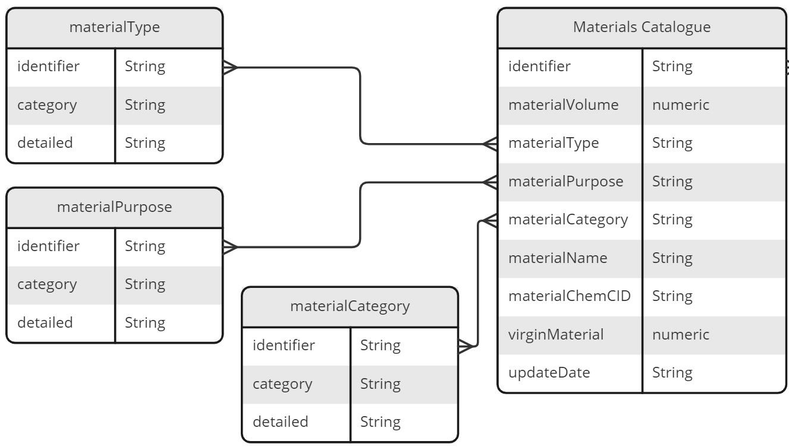

# Base Materials

The base materials schema contains information regarding the core materials. These are then combined together within the materials table to create more complicated materials.

## Table
|Column|<div style="width:90px">Status</div>|Format|Notes|
|:-|:-|:-|:-|
|identifier|`required`|String|A globally unique identifier. See identifiers section for information on how to construct this identifier|
|baseMaterialName|`required`|String|The name of the base material this row relates to. `e.g., Polypropylene or Aluminium or Silica`|
|baseMaterialType|`recommended`|String|Is the base material 'synthetic' or 'biobased'? Use the identifier of the material type that this row relates to. The entry here should be drawn from the [Material Type Controlled List](https://github.com/OpenDataManchester/PPP/blob/main/docs/5_Controlled_Lists/5_2_1_Material_Type.csv){target=_blank}.|
|baseMaterialCategory|`required`|String|The category this base material row relates to. The entry here should be drawn from the [Material Category Controlled List](https://github.com/OpenDataManchester/PPP/blob/main/docs/5_Controlled_Lists/5_2_3_Material_Category.csv){target=_blank}.|
|materialChemCID|`recommended`|String|The PubChem CID for the exact bse material used. The PubChem CID is PubChem's compound identifier, which is a non-zero integer for a unique chemical structure. PubChem CID can be found using their [search](https://pubchem.ncbi.nlm.nih.gov/){target=_blank}. If for some reason the PubChem CID cannot be located, consider contributing to PubChem and create the compound identifier. However, if this cannot be done, please enter `Unknown`.|
|certification|`recommended`|Boolean|Does the base material have a certificate (e.g. FSC, REACH, FSA etc.)?|
|certificationSource|`recommended`|String|What source provided the certificate? The entry should be the [Certification Source Controlled List](https://github.com/OpenDataManchester/PPP/blob/main/docs/5_Controlled_Lists/5_2_4_Certification_Source.csv){target=_blank} identifier.|
|certificationDate|`recommended`|String|The date that the certificate was provided/last updated. Use the format `dd/mm/yyyy`.|
|manufacturedCountry|`recommended`|Numeric|The country the component was manufactured in. Use the country numeric [ISO codes](https://www.iban.com/country-codes){target=_blank} as described in the ISO 3166 international standard.|
|updateDate|`required`|String|The date that the base material was provided/last updated. Use the format `dd/mm/yyyy`.|

## Diagram

``` mermaid
erDiagram
  BASE_MATERIALS {
    identifier String
    baseMaterialName String
    baseMaterialType String
    baseMaterialCategory String
    materialChemCID String
    certification Boolean
    certificationSource String
    certificationDate String
    updateDate String
  }
  BASE_MATERIALS }o..o{ CONTOLLED_LISTS : attritubes
  BASE_MATERIALS }o--o{ MATERIALS : within
      CONTOLLED_LISTS {
    materialType recommended
    materialCategory required
    certificationSource recommended
  }
```

<!-- <figure markdown>
[{ width="450" }](https://opendatamanchester.github.io/PPP/img/material_catalogue-v1.0.0-22-12-20.png){target=_blank}
  <figcaption>Data schema</figcaption>
</figure> -->

## Template

Base materials should be provided as a separate csv file, in tidy format. This means that each row of the csv file should be one base material. An example is provided.

The specification of this csv file is as follows:

[Material_Catalogue_Template.csv](https://www.opendatamanchester.org.uk/wp-content/uploads/2023/01/7_1_7_Materials_Catalogue_Template.csv){target=_blank}

## Example

=== "JSON - #1"

    ``` json linenums="1"
    --Food grade synthetic polyethylene terephthalate (PET) made in the UK
    {
      "identifier": "A4BAE07C-1847-CD8E-C933-6FD30478423B",
      "baseMaterialName": "PET",
      "baseMaterialType": {
        "identifier":"material-component-catalogue-type-0002",
        "category":"synthetic",
        "detailed":"derived from crude oil, natural gas or coal."
      },
      "baseMaterialCategory": {
        "identifier":"material-component-catalogue-category-0007",
        "category":"plastic",
        "detailed":""
      },
      "materialChemCID": "223961227",
      "certification": "TRUE",
      "certificationSource": {
        "identifier":"certification-source-0002",
        "category":"FSA",
        "detailed":"The Food Standards Agency (FSA) is the independent government department working to protect public health and consumers’ wider interests in relation to food in England, Wales and Northern Ireland."
      },
      "certificationDate": "01/08/2022",
      "manufacturedCountry": {
        "Country": "United Kingdom of Great Britain and Northern Ireland (the)",
        "Numeric": 826
      },
      "updateDate": "01/08/2022",
    }
    ```
=== "JSON - #2"

    ``` json linenums="1"
    --FSC accredited spruce grown in Scotland
    {
      "identifier": "a5e6b8bc-ade8-4660-857e-d397243f6b57",
      "baseMaterialName": "Spruce",
      "baseMaterialType": "",
      "baseMaterialCategory": {
        "identifier":"material-component-catalogue-category-0009",
        "category":"wood",
        "detailed":""
      },
      "materialChemCID": "",
      "certification": "TRUE",
      "certificationSource": {
        "identifier":"certification-source-0001",
        "category":"FSC",
        "detailed":"The Forest Stewardship Council (FSC) is an international, non-governmental organisation dedicated to promoting responsible management of the world’s forests."
      },
      "certificationDate": "01/08/2022",
      "manufacturedCountry": {
        "Country": "United Kingdom of Great Britain and Northern Ireland (the)",
        "Numeric": 826
      },
      "updateDate": "01/08/2022",
    }
    ```
=== "CSV download"

    * [Material Catalogue example download](https://www.opendatamanchester.org.uk/wp-content/uploads/2023/01/7_1_7_Materials_Catalogue_Example.csv){target=_blank}