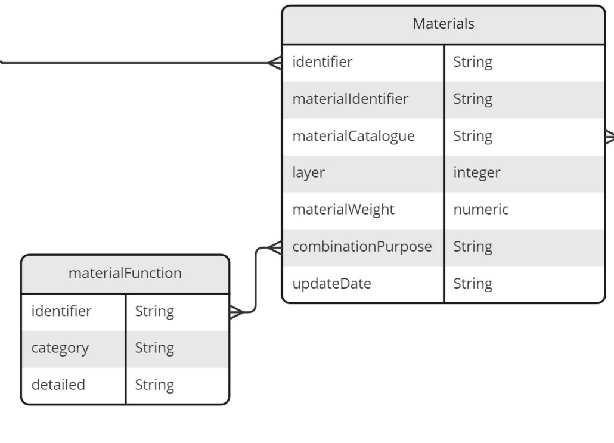

# Materials

The materials schema contains information regarding the materials that are used within components. These maybe a single base material from the materials catalogue and a combination of materials.

## Table
|Column|<div style="width:90px">Status</div>|Format|Notes|
|:-|:-|:-|:-|
|identifier|`required`|String|A globally unique identifier. See identifiers section for information on how to construct this identifier|
|materialIdentifier|`required`|String|The unique identifier of the created materials. See identifiers section for information on how to construct this identifier.|
|materialCatalogue|`required`|String|The unique identifier of the material that this row relates to. There must be an equivalent record in the `material_Catalogue` data|
|layer|`recommended`|integer|The layer associated with the component. The inner most layer (the layer closest to the product) denoted as 1, and the outermost layer is the biggest number.|
|materialWeight|`recommended`|numeric|The percentage of the total materials making-up the component. For every unique componentCatalogue, weightMaterial should add to 100%.|
|combinationPurpose|`recommended`|String|Why is this material being used? Use the identifier of the material function that this row relates to. The entry here should be drawn from the material function controlled list.|
|updateDate|`required`|String|The date that the material was provided/last updated. Use the format `dd/mm/yyyy`.|

## Diagram

<figure markdown>
[{ width="450" }](https://opendatamanchester.github.io/PPP/img/materials-v1.0-2022-12-20.png){target=_blank}
  <figcaption>Data schema</figcaption>
</figure>

## Template
Materials should be provided as a separate csv file, in tidy format. This means that each row of the csv file should be one material for a component. An example is provided.

The specification of this csv file is as follows:

[Materials_Template.csv](https://www.opendatamanchester.org.uk/wp-content/uploads/2023/01/7_1_2_Materials_Template.csv){target=_blank}

## Example

=== "JSON"

    ``` json linenums="1"
    {
      "identifier": "DCEE1F88-A83B-5BBC-D2D9-6A862B344977",
      "materialIdentifier": "278EFE8A-720A-06C1-A411-CB94878AD3E2",
      "materialCatalogue": "A4BAE07C-1847-CD8E-C933-6FD30478423B",
      "layer": "1",
      "materialWeight": "100",
      "combinationPurpose": {
        "identifier":"material-component-catalogue-purpose-0015",
        "category":"structure",
        },
      "updateDate": "01/08/2022",
    }
    ```
=== "CSV download"

    * [Materials example download](https://www.opendatamanchester.org.uk/wp-content/uploads/2023/01/7_1_2_Materials_Example.csv){target=_blank}

## Guide for how to take measurements

### Units

All measurements should be given using the metric system.

- Weight: grams (g)

Numbers should be entered with a decimal place. Use the decimal / full stop / period character as a separator. Do not exceed 3 decimal places. When rounding, use convential rounding methods: for 5 and above round up, 4 and below round down. For example: volume = 0.67952 rounded to 0.68. 

**Important**: When converting between systems of measurement, perform the conversion first and then apply the convential rounding. This will give more accuracy and consistency.
