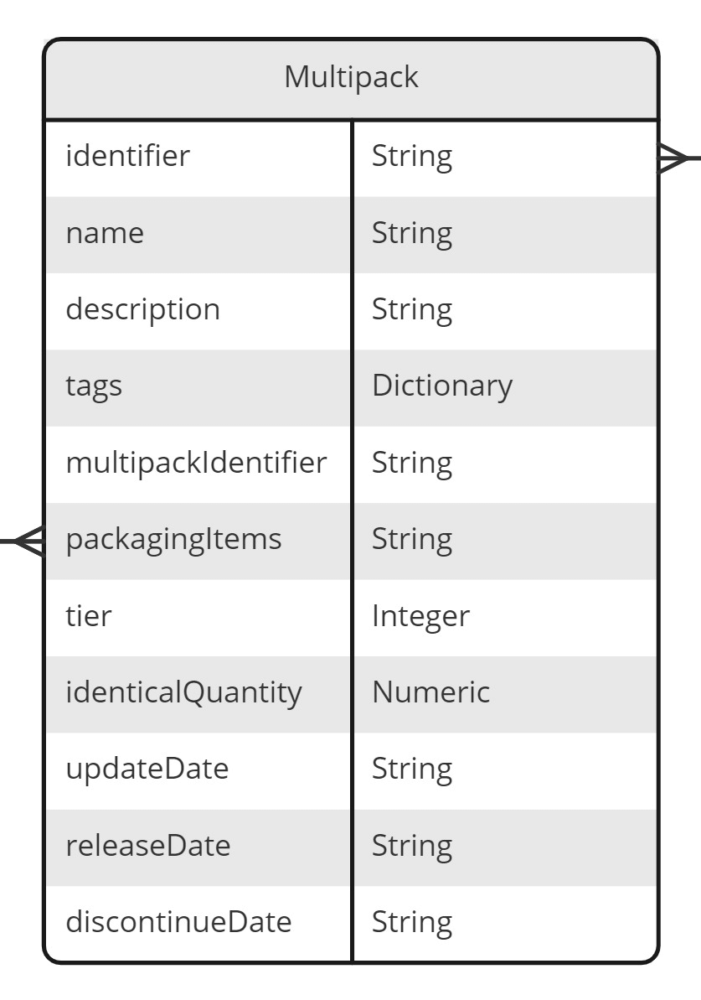

# Multipack

The multipack schema contains information regarding the multipacks that are used to create loads. These are created from a number of either identical or different complete packages from the complete packaging schema.

## Table
|Column|<div style="width:90px">Status</div>|Format|Notes|
|:-|:-|:-|:-|
|identifier|`required`|String|A globally unique identifier. See identifiers section for information on how to construct this identifier|
|name|`recommended`|String|The name of this multipack.|
|description|`recommended`|String|A brief description of this multipack.|
|tags|`recommended`|Dictionary|A dictionary of identifiers that might be used to identify the complete packaging in other systems. For example: bar codes or global trade item number (gtin). To provide tags please follow this format. `{'tagName1': 'identifier1', 'tagName2': 'identifier2'}`|
|multipackIdentifier|`required`|String|The unique identifier of the created multipack. A globally unique identifier. See identifiers section for information on how to construct this identifier.|
|packagingItems|`required`|String|The complete packaging and/or the component identifiers used to create the multipack. There must be an equivalent record in the `complete_packaging` or `component_Catalogue` data.|
|tier|`recommended`|Integer|The tier associated with the multipack. The inner most tier denoted as 1, and the outermost tier is the biggest number.|
|identicalQuantity|`required`|Numeric|Number of identical units for the unique complete packaging item or a component this row corresponds to.|
|updateDate|`required`|String|The date that the multipack was provided/last updated. Use the format `dd/mm/yyyy`.|
|releaseDate|`recommended`|String|The date that the component will be available to use. Use the format `dd/mm/yyyy`.|
|discontinueDate|`recommended`|String|The date that the component will no longer be available to use. Use the format `dd/mm/yyyy`.|

## Diagram

<figure markdown>
[{ width="450" }](https://opendatamanchester.github.io/PPP/img/multipack-v1.0.0-22-12-20.png){target=_blank}
  <figcaption>Data schema</figcaption>
</figure>

## Template

**Note:** The multipack portion is optional (only applies to multipacks). If the complete packaging or component is *not* in a multipack, all of the fields below are optional. 

Multipack should be provided as a separate csv file, in tidy format. This means that each row of the csv file should be one multipack of a load. An example is provided.

The specification of this csv file is as follows:

[multipack.csv](https://github.com/OpenDataManchester/PPP/blob/main/docs/7_Supporting_Files/7_1_4_Multipack_Template.csv){target=_blank}

## Example

=== "JSON"

    ``` json linenums="1"
    {
      "identifier": "B9574E9A-A561-BCA6-0E36-448A2E46B2BF",
      "name": "4 pack of guacamole dip",
      "description": "4 tubs of guacamole that are sold together. Not to be sold seperately.",
      "tags": {
        "GTIN":"00123456789012",
        },
      "multipackIdentifier": "346C5546-282B-C040-CE74-DD0DD4688C0B",
      "packagingItems": "C29B4703-121C-7552-D905-FD5AB263D611",
      "tier": "1",
      "identicalQuantity": "4",
      "updateDate": "01/08/2022",
      "releaseDate": "01/08/2022",
      "discontinueDate": "",
    }
    ```

=== "CSV"

    [Coming soon](https://opendatamanchester.org.uk)