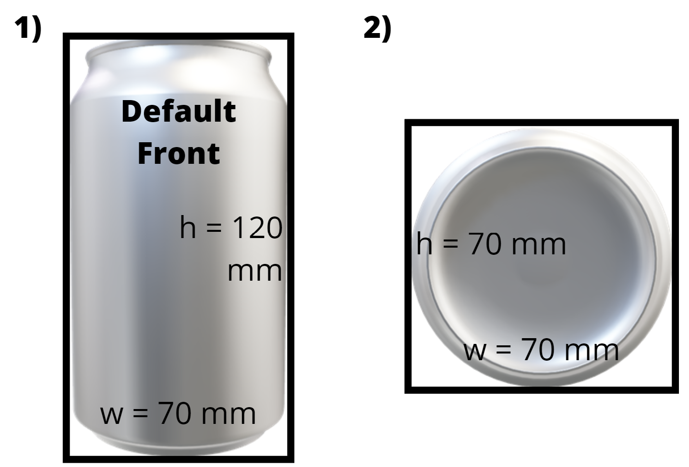
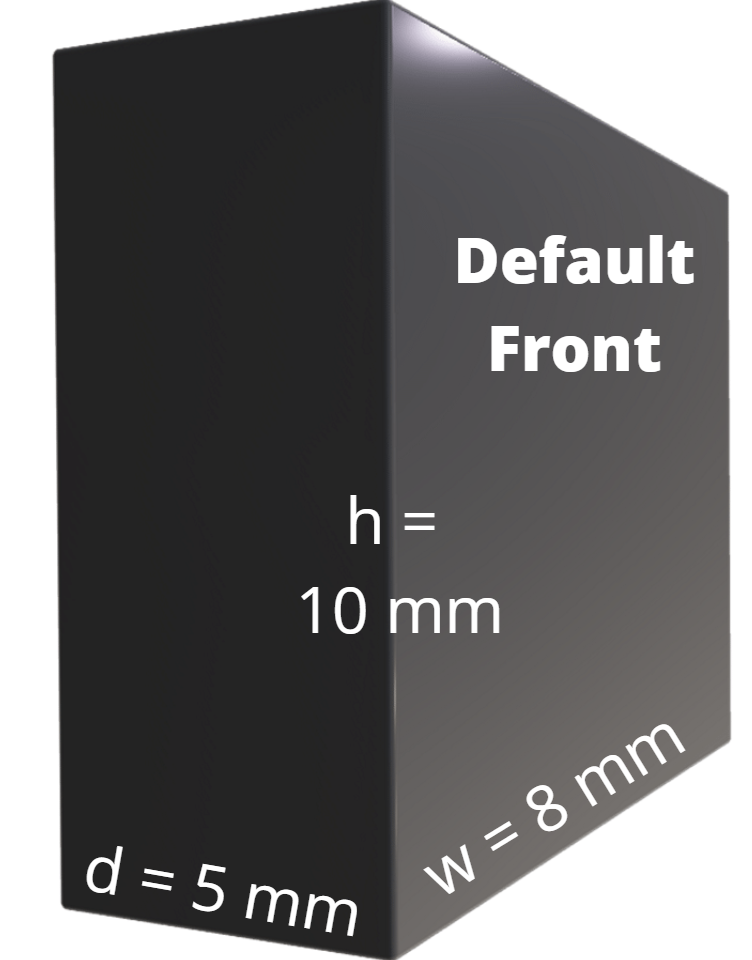
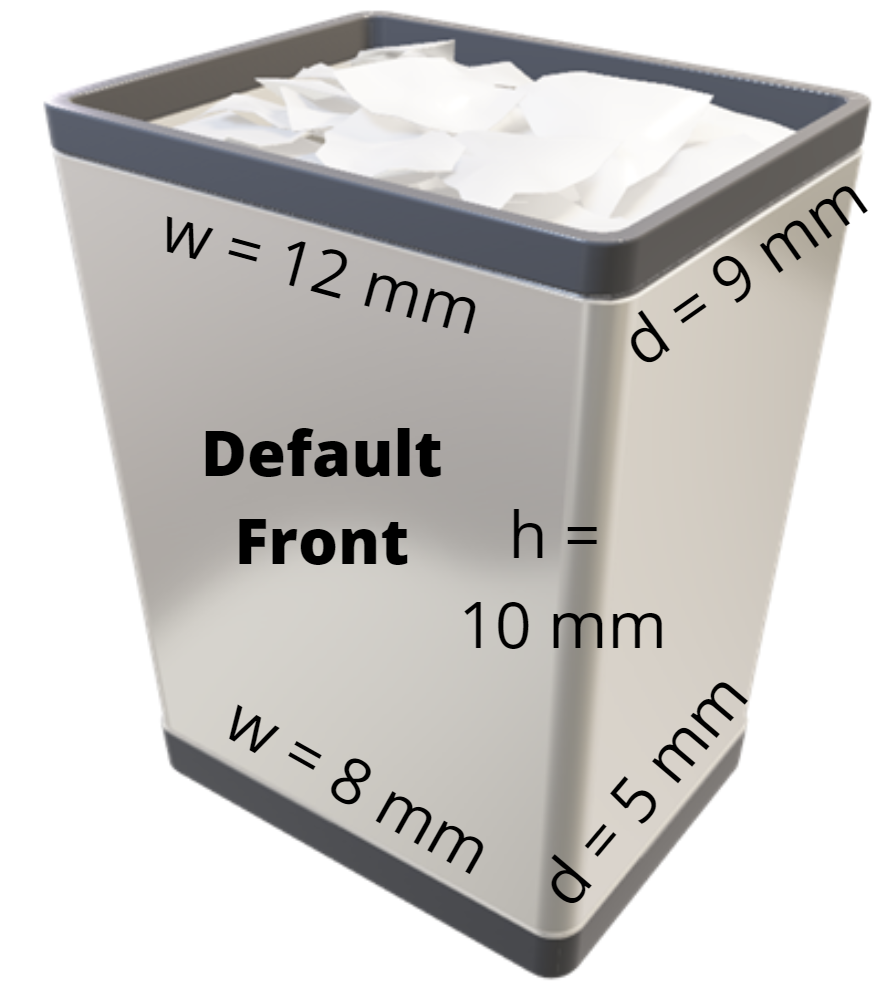

# Measurements

The measurements relationship list identifies the different measurement that an item in each schema can have. 

## Table
|Column|<div style="width:90px">Status</div>|Format|Notes|
|:-|:-|:-|:-|
|measurementIdentifier|`mandatory`|UUID|A globally unique identifier. See [identifiers](../4_Identifiers/4_1_Identifiers.md) section for information on how to construct this identifier|
|itemIdentifier|`mandatory`|UUID|The unique identifier of the items that this component is made of. There must be an equivalent record in the `Base_Materials`, `Materials`, `Components`, `Complete_Packaging`, `Multipacks` OR `Load` data.|
|measureIdentifier|`mandatory`|ID|The measure type of this item. The entry here should be drawn from the [meausures](../5_Controlled_Lists/5_017_Measures.md).|
|measurementValue|`mandatory`|Decimal|The value of this measurement. |
|tolerance|`optional`|Decimal|The threshold of the measure that this item can vary by. |
|toleranceType|`optional`|String|The threshold of the measurment type this can be given in `unit` or `percentage`; where `unit` matches to the `measure` unit. For example if the measure unit is grams, the tolerance type will also be grams. |
|date|`optional`|Date|The date that the measure was last verified/measured. Use the format `yyyy-mm-dd` adhering to the [ISO 8601 dateTime standard](https://www.iso.org/iso-8601-date-and-time-format.html).|

## Diagram

``` mermaid
erDiagram
  as["ALL SCHEMA"]
  as }o..o{ MEASUREMENTS : attributes
  MEASUREMENTS {
    measurementIdentifier UUID "*"
    itemIdentifier UUID "*"
    measureIdentifier ID "*"
    measurementValue Decimal
    tolerance Decimal
    toleranceType String
    date Date
  }
  MEASUREMENTS }o--o{ CONTROLLED_LISTS : attributes
  CONTROLLED_LISTS {
    measures mandatory
  }
```
## Example

=== "Wine bottle Measurements - JSON"

    ``` json linenums="1" hl_lines="3 4"
    [
      {
        "measurementIdentifier": "e83b250b-8fd5-472f-82d1-049b0c4e9ca9",
        "itemIdentifier": "94108707-b914-43f3-bed5-93adbbd208c1",
        "measureIdentifier": "measure-0001",
        "measurementValue": 700,
        "tolerance": 6,
        "toleranceType": "percentage"
      },
      {
        "measurementsIdentifier": "e83b250b-8fd5-472f-82d1-049b0c4e9ca9",
        "itemIdentifier": "94108707-b914-43f3-bed5-93adbbd208c1",
        "measureIdentifier": "measure-0002",
        "measurementValue": 305,
        "date": "2015-06-16"
      },
      {
        "measurementsIdentifier": "e83b250b-8fd5-472f-82d1-049b0c4e9ca9",
        "itemIdentifier": "94108707-b914-43f3-bed5-93adbbd208c1",
        "measureIdentifier": "measure-0003",
        "measurementValue": 72.4,
        "date": "2015-06-16"
      },
      {
        "measurementsIdentifier": "e83b250b-8fd5-472f-82d1-049b0c4e9ca9",
        "itemIdentifier": "94108707-b914-43f3-bed5-93adbbd208c1",
        "measureIdentifier": "measure-0004",
        "measurementValue": 72.4,
        "date": "2015-06-16"
      }
    ]
    ```
=== "Wine bottle Measurements - XML"

    ``` xml linenums="1" hl_lines="3 4"
    <?xml version="1.0" encoding="UTF-8" ?>
    <root>
      <row>
        <measurementIdentifier>e83b250b-8fd5-472f-82d1-049b0c4e9ca9</measurementIdentifier>
        <itemIdentifier>94108707-b914-43f3-bed5-93adbbd208c1</itemIdentifier>
        <measureIdentifier>measure-0001</measureIdentifier>
        <measurementValue>700</measurementValue>
        <tolerance>6</tolerance>
        <toleranceType>percentage</toleranceType>
      </row>
      <row>
        <measurementsIdentifier>e83b250b-8fd5-472f-82d1-049b0c4e9ca9</measurementsIdentifier>
        <itemIdentifier>94108707-b914-43f3-bed5-93adbbd208c1</itemIdentifier>
        <measureIdentifier>measure-0002</measureIdentifier>
        <measurementValue>305</measurementValue>
        <date>2015-06-16</date>
      </row>
      <row>
        <measurementsIdentifier>e83b250b-8fd5-472f-82d1-049b0c4e9ca9</measurementsIdentifier>
        <itemIdentifier>94108707-b914-43f3-bed5-93adbbd208c1</itemIdentifier>
        <measureIdentifier>measure-0003</measureIdentifier>
        <measurementValue>72.4</measurementValue>
        <date>2015-06-16</date>
      </row>
      <row>
        <measurementsIdentifier>e83b250b-8fd5-472f-82d1-049b0c4e9ca9</measurementsIdentifier>
        <itemIdentifier>94108707-b914-43f3-bed5-93adbbd208c1</itemIdentifier>
        <measureIdentifier>measure-0004</measureIdentifier>
        <measurementValue>72.4</measurementValue>
        <date>2015-06-16</date>
      </row>
    </root>
    ```

## Guide for how to take measurements

### Units

All measurements should be given using the metric system.

- Height: millimetre (mm)
- Width: millimetre (mm)
- Length: millimetre (mm)
- Volume: cubic metre (cm3)
- Weight: grams (g)
- Weight Tolerance: percent (%)

Numbers should be entered with a decimal place. Use the decimal / full stop / period character as a separator. Do not exceed 3 decimal places. When rounding, use convential rounding methods: for 5 and above round up, 4 and below round down. For example: volume = 0.67952 rounded to 0.68. 

**Important**: When converting between systems of measurement, perform the conversion first and then apply the convential rounding. This will give more accuracy and consistency.

### Default Front of a component
Prior caputuring measurements, first determine the default front of the component, this is similar to [GS1](https://www.gs1.org/){target=_blank} (Note: GS1 rules are specified only for complete packaging and not components. Therefore, there are subtle differences to convert from taking a measurement for the complete packaging versus a component). In this standard, as with [GS1](https://www.gs1.org/standards/gs1-package-and-product-measurement-standard/current-standard#4-Consumer-(end-user)-trade-items+4-2-Determining-the-default-front){target=_blank}, the default front is the face with the largest surface area, where area is equal to the `width` times the `height`.

**Important**: Determining of default front provides a consistent, repeatable process to find measurements for a given component.

<center>{:height="40%" width="30%"}</center>
<center>_Figure 1: An example for finding the default front of a component. The default front is the face of the with the largest area (Area = `width` X `height`)_</center>

Some components have the same surface area, thus more than one possible front. These components can be presented both vertically and horizontally. If a component has more than one possible front, the highest side is considered to be the default front.

**Note**: Calculating the area for a rectangular component is simple. However, for non-rectangular components (for example, components with a cylindrical or irregular form), the method to calculate the area is:

- First break the component into multiple sides. Then, for:
    - a round component: do not use (=pi*r^2) to calculate the area. Instead, draw "two dimensional" rectangles around the round component's sides and then calculate the area for each side.
    - any other shape component: draw a "two dimensional" rectangle around the sides of the component, and then calculate the area for each side.
- The side with the maximum area then becomes the default front of that component.

<center>{:height="40%" width="50%"}</center>
<center>_Figure 2: An example for finding the default front of an irregular shaped component. After drawing rectangles around the component, the default front is the face of the with the largest surface area (Area = `width` X `height`)_</center>

### Measuring the height, width, and depth of a component
After the default front has been determined, as with [GS1](https://www.gs1.org/standards/gs1-package-and-product-measurement-standard/current-standard#4-Consumer-(end-user)-trade-items+4-3-Determining-the-height,-width-and-depth){target=_blank}, it is possible to determine the height, width, and depth of a component. 

1. For rectangular components: 
    - Height: from the base to the top
    - Width: from the left to the right
    - Depth: from the front to the back


<center>{:height="40%" width="30%"}</center>
<center>_Figure 3: Example of measuring the height, width, and depth for a rectangular component._</center>

**Note:** If there are two different measurements for the height, width, or depth, always report the maximum measurement.

<center>{:height="40%" width="30%"}</center>
<center>_Figure 4: Example of reporting the maximum width, when there are two different size widths. Here, the width reported would be 12 mm because it is larger than the 8 mm. Additionally, there are two different sized depths. Here, the 9 mm depth would be reported because it is larger than the 5 mm depth._</center>


2. For irregular shaped components:
Similar to finding the default front of an irregularly shaped component, draw a "three dimensional" rectangle around the component.
    - Height: from the base to the top
    - Width: from the left to the right
    - Depth: from the front to the back

3. For unformed, flexible components:
    - Take the measurements as if the component was fully formed and filled.

4. For standing components:
    - Height: from the flat surface to the top most point
    - Width: from the left-most point to the right-most point
    - Depth: from the default front to the farthest opposite surface

5. For components with leaning or irregular verticlas:
    - Height: from the flat surface to the top most point (parallel to the vertex)
    - Width: from the left most point to the right most point 
    - Depth: from the default front to the farthest opposite surface

6. For components that are cylindrical:
    - For cylindrical items two dimensions will be nominally equal. Which dimensions are equal is determined by the result of determination of the default front.