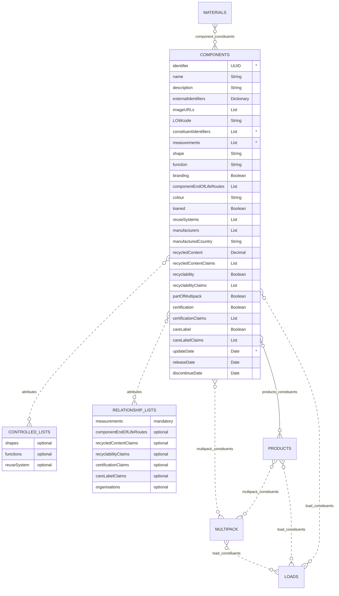

# Components

The components schema contains information regarding the individual components that are used to create products. These maybe created from:

 - a single material
 - a combination of materials
 - other components
 - a combination of materials and components

## Table
|Column|
Status
|Format|Notes|
|:-|:-|:-|:-|
|identifier|`mandatory`|UUID|A globally unique identifier. See [identifiers](../identifiers/index.md) section for information on how to construct this identifier|
|name|`mandatory`|String|The name of this component.|
|description|`optional`|String|A brief description of this component.|
|externalIdentifiers|`optional`|Dictionary|A dictionary of identifiers that is used to identify the component in other data standards, software systems or protocols. For example: manufacturer's own primary key, bar codes or global trade item number (gtin). To provide external identifiers follow this format. `{'externalIdentifierName1': 'identifier1', 'externalIdentifierName2': 'identifier2'}`. The entries could be drawn from the [External Identifiers Controlled List](../controlled-lists/external-identifiers.md).|
|imageURLs|`optional`|List|A list of URLs that links to a picture of the component. Please see the guidelines below on how to capture the image and name the URL.|
|LOWcode|`optional`|String|The list of waste code for **only** the component, by itself. LOW code is synonymous with European Waste Catalogue Code (EWC). For example: a zip would have a LOWcode of `20 01 10`. Please use [Dsposal](https://dsposal.uk/browse/ewc) or [legislation.gov](https://www.legislation.gov.uk/uksi/2005/895/schedule/1/made) to find the LOWcode. **Note**: The LOWcode can based on its combination with other components and the actual product contained in the products. Be sure to only include the component LOWcode.|
|constituentIdentifiers|`mandatory`|List|The information regarding the constituents that are combined to create this component. The entries should be from the [Component Constituents List](../constituent-lists/component-constituents.md) identifier.|
|measurements :fontawesome-solid-square-plus:{ title="Added to this version" .addition }|`mandatory`|List|The information regarding the measurements of the component. The entries should be from the [Measurements Relationship List](../relationship-lists/measurements.md).|
|shape|`optional`|String|What is the shape of the component? The entry should contain the [shapes controlled list](../controlled-lists/shapes.md) identifier for the component.|
|function|`optional`|String|What is the function of the component? The entry should contain the [functions controlled list](../controlled-lists/functions.md) identifier for the component.|
|branding|`optional`|Boolean|Does the component contain your own brand (logo, trademark, or any distinctive mark)? Answer as: `TRUE` for yes and `FALSE` for no.|
|componentEndOfLifeRoutes|`optional`|List|The information regarding this component's proposed end of life routes. The entries should be the [component end of life routes](../relationship-lists/component-end-of-life-routes.md) identifiers.|
|colour|`optional`|String|The actual colour of the component at point of production using CMYK (Cyan-Magenta-Yellow-blacK) values. The format is specified according to cmyk(C%, M%, Y%, K%), where C, M, Y, and K are the percent values for the cyan, magenta, yellow, and black values of the color. For example: black is `cmyk(0%,0%,0%,100%)`. If there are multiple colours input `decorative`.|
|loaned|`optional`|Boolean|Is the component hired or loaned? Answer as: `TRUE` for yes and `FALSE` for no. This is for this component ONLY, if the entire product is loaned or hired then use the product schema.|
|reuseSystems|`optional`|List|The system(s) that facilitates the reuse of the component  `e.g., ????`. The entries should be the [reuse systems controlled list](../controlled-lists/reuse-systems.md) identifier(s).|
|partOfMultipack|`optional`|Boolean|Is the component part of a multipack? Answer as: `TRUE` for yes and `FALSE` for no.|
|recycledContent|`optional`|Decimal|Positive decimal only, maximum value is 100.00. Value should equated to a percentage (e.g. 30 = 30%) The minimum allowable percent of how much recycled content is included in the makeup of the component.|
|recycledContentClaims|`optional`|List|The information regarding the recycled contents. The entries should be the [recycled content claims relationship list](../relationship-lists/recycled-content-claims.md) indentifiers.|
|recyclability|`optional`|Boolean|Is the component recyclable (as determined by a reputable source)? Answer as: `TRUE` for yes and `FALSE` for no.|
|recyclabilityClaims|`optional`|List|The information regarding this recyclability claims. The entries should be the [recyclability claims relationship list](../relationship-lists/recyclability-claims.md) identifiers.|
|certification|`optional`|Boolean|Does the component have a certificate (e.g. FSC, REACH, FSA etc.)? Answer as: `TRUE` for yes and `FALSE` for no.|
|certificationClaims|`optional`|List|The information regarding the certifications. The entries should be the [certification claims relationship list](../relationship-lists/certification-claims.md) identifiers.|
|careLabel :fontawesome-solid-square-plus:{ title="Added to this version" .addition }|`optional`|Boolean|Does the component have a care label (e.g. GINETEX, ASTM D5489, ISO 20471 etc.)? Answer as: `TRUE` for yes and `FALSE` for no.|
|careLabelClaims :fontawesome-solid-square-plus:{ title="Added to this version" .addition }|`optional`|List|The information regarding the care labels. The entries should be the [care label claims relationship list](../relationship-lists/care-label-claims.md) identifiers.|
|manufacturers|`optional`|List|The information regarding the manufacturer(s). The entries should be the [Organisations Relationship List](../relationship-lists/organisations.md identifiers.|
|manufacturedCountry|`optional`|String|The country the component was manufactured in. Use the country numeric [ISO codes](https://www.iso.org/obp/ui/#search){target=_blank} as described in the [ISO 3166 international standard](https://www.iso.org/iso-3166-country-codes.html){target=_blank}.|
|updateDate|`mandatory`|Date|The date that the component was provided/last updated. Use the format `yyyy-mm-dd` adhering to the [ISO 8601 dateTime standard](https://www.iso.org/iso-8601-date-and-time-format.html).|
|releaseDate|`optional`|Date|The date that the component will be available to use. Use the format `yyyy-mm-dd` adhering to the [ISO 8601 dateTime standard](https://www.iso.org/iso-8601-date-and-time-format.html).|
|discontinueDate|`optional`|Date|The date that the component was discontinued, meaning it was no longer available for purchase. Use the format `yyyy-mm-dd` adhering to the [ISO 8601 dateTime standard](https://www.iso.org/iso-8601-date-and-time-format.html).|
|listedDate|`optional`|Date|The date that the component was first listed for purchase. Use the format `yyyy-mm-dd` adhering to the [ISO 8601 dateTime standard](https://www.iso.org/iso-8601-date-and-time-format.html){target=_blank}.|

## Diagram 

## Guide for component images
As with providing measurements, please first find the default front of the component. The image capturing process and naming convention is similar to [GS1](https://www.gs1.org/standards/gs1-product-image-specification-standard/current-standard#1-Introduction){target=_blank}. As with measurements, we altered the gs1 standard for capturing the component.

### Type of Image
For the purposes of this standard, we define the differences between photographic and rendered images. Note: both types are accepted but the naming convention will differ based on image type so that images have unique names and do not having naming conflicts.

- **Photographic image**: the result of the electronic or chemical capture of a likeness of a physical object with the use of a camera.
- **Rendered image**: the result of the creation of a digital likeness of a physical object with the use of a computer and software.

### Image Recommendations
- Provide coloured images. However, do not provide colour casts. Colour should be as rich, vibrant and eye-catching as possible
- Contrast and exposure should be balanced; avoid high contrast effects and "blown-out" highlights
- Images should not be overly sharpened
- Components should be centred in Margins to cover 95% on the canvas.
- Graphic rendering of a component should be realistic.
- Do not provide layers, guides or rulers in the images.
- Background layer should be white (RGB 255,255,255).
- Remove signatures, "finger printing" or visible watermarks. No compression artifacts. No interpolation ("resizing up").

### File size
- 900x900 to 2400x2400 pixels

### Component faces
After determining the default front, the possible faces, in relation to the default front, are:
1. Default Front
2. Left
3. Top
7. Back
8. Right
9. Bottom

### Naming convention for URL
Please follow this naming convention: 
- component identifier
- underscore `_`
- type of image (`photographic` or `rendered`)
- underscore `_`
- component face (`1`: Default front, `2`: Left, `3`: Top, `7`: Back, `8`: Right, `9`: Bottom)
- orientation (`C`: Centre, `L`: left, `R`: right, `N`: No plunge angle)

**Example**: An image for a component that is rendered with a default front facing image and centred orientation. `identifier123_rendered_1C.jpg`

